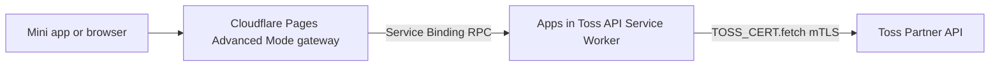

# AIT Kit

Reusable Apps in Toss API building blocks for Cloudflare and backend adapters.

This repository starts with the runtime-neutral Toss API core, a Cloudflare
Service Binding provider, and a Pages Advanced Mode gateway example. The package
scope is `@ait-kit`.

## Architecture



Pages is the public gateway. It can host static assets, public oRPC handlers,
session logic, and application business logic. The Apps in Toss API Worker is an
internal RPC provider. Its `fetch` handler is only a smoke/debug compatibility
fallback for HTTP proxy clients. The template disables `workers.dev` by default,
and POST fallback routes require the `TOSS_HTTP_BEARER_TOKEN` secret.

## Packages

- `@ait-kit/api-core`: runtime-neutral Toss API core, request/response
  normalization, and the low-level `MtlsClient` port.
- `@ait-kit/api-client`: HTTP client helpers for backends that call a Toss
  mTLS proxy over a private network.
- `@ait-kit/api-orpc`: public oRPC contract helpers for a Pages gateway.
- `@ait-kit/api-cloudflare-service`: Cloudflare `WorkerEntrypoint` service that
  exposes typed Service Binding RPC methods backed by `TOSS_CERT.fetch`.

## Examples And Templates

- `examples/cloudflare-pages-gateway-advanced`: Pages Advanced Mode gateway that
  calls the Toss API Worker through RPC service binding methods.
- `templates/cloudflare-toss-api-service`: deployable Toss API Service Worker
  template. This is where the Deploy to Cloudflare badge belongs.

## Local Checks

```bash
bun install
bun run check
```

## Releases

Public npm packages are managed by Sampo:

- `@ait-kit/api-core`
- `@ait-kit/api-client`
- `@ait-kit/api-orpc`
- `@ait-kit/api-cloudflare-service`

Use `sampo add` for user-facing changes, then let the GitHub release workflow
prepare release PRs. Publishing is handled by `.github/workflows/publish.yml`
and `scripts/publish-oidc.sh`, which use Bun for builds and npm CLI for OIDC
Trusted Publishing. Configure npm Trusted Publishing for
`.github/workflows/publish.yml`, and install Sampo's GitHub App for PR changeset
reminders: https://github.com/apps/sampo-s-bot.

Forward mode uses Cloudflare mTLS bindings. Upload a certificate with Wrangler
and then add an `mtls_certificates` binding named `TOSS_CERT` to the service
Worker config. The template defaults to stub mode so it can be deployed before
certificate material is configured. Health checks report `ready: false` when
forward mode is enabled without an mTLS transport.

The generic raw mTLS relay is disabled by default. Enable it only for trusted
internal callers by setting `TOSS_ALLOW_RAW_MTLS=true` on the service Worker.
If an HTTP route is intentionally attached, set `TOSS_HTTP_BEARER_TOKEN` with
`wrangler secret put` and pass the same value to the HTTP client `token` option.

## TrailBase Kit Reuse

`trailbase-apps-in-toss-kit` can later depend on these packages directly instead
of carrying an internal copy of the Toss mTLS core. The intended migration is:

1. Publish `@ait-kit/api-core` and `@ait-kit/api-cloudflare-service`.
2. Keep the existing TrailBase Bun proxy behavior stable.
3. Replace its internal core import with `@ait-kit/api-core`, and use
   `@ait-kit/api-client` for HTTP proxy callers that need shared endpoint
   constants.
4. Keep certificates mounted only in the proxy or Cloudflare Worker runtime.
